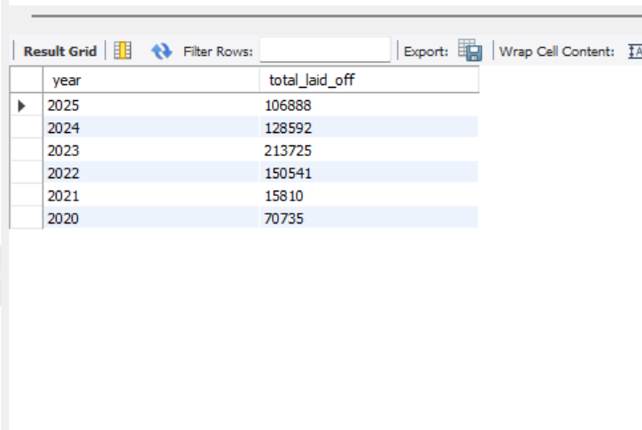
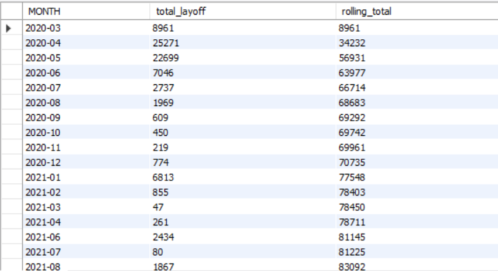
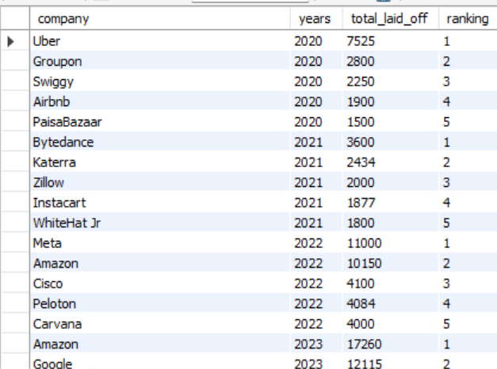
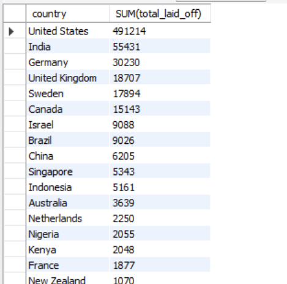
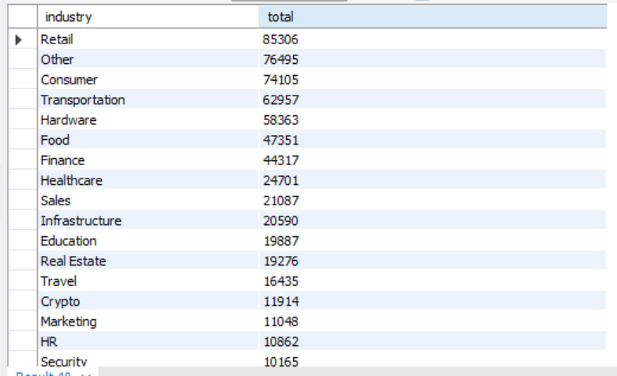
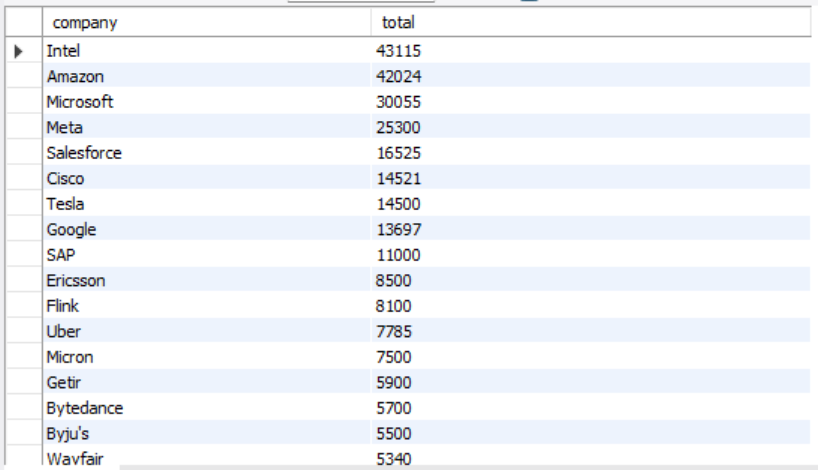

# 📊 Global Layoff Trend Analysis (SQL)

## 📌 Overview

This project presents a structured SQL-based analysis of 43,264 global layoff records to uncover workforce trends across companies, industries, countries, and time.

The focus was on data cleaning, standardization, and extracting meaningful business insights using MySQL.

## 🛠 Tools & Techniques

MySQL

Common Table Expressions (CTEs)

Window Functions (ROW_NUMBER, DENSE_RANK)

Aggregation & Date Functions

Data Cleaning & Standardization

## 📈 Analysis & Visual Insights
🔹 Year-wise Layoffs

  

🔹 Rolling Monthly Trend

  

🔹 Top 5 Companies Per Year

  

🔹 Country-wise Layoffs

  

🔹 Industry-wise Layoffs

  

🔹 Top Companies Overall

  

##💡 Key Insights

2023 recorded the highest total layoffs in the dataset.

A small group of companies contributed significantly to total workforce reductions.

Retail, Consumer, and Transportation sectors showed notable layoff concentration.

Clear year-over-year fluctuations highlight changing economic conditions.

## 📂 Dataset

Public global workforce layoff dataset containing 43,264 records.
